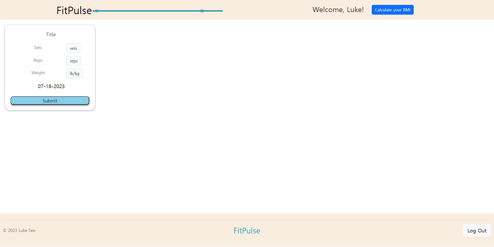

# Welcome to FitPulse

## How to Run

Follow these steps to get your application up and running:

### Prerequisites

- Node.js installed on your machine
- npm (Node Package Manager)

### Installation

1. Clone this repository to your local machine.
2. Open a terminal and navigate to the project directory.

### Server Setup

1. Install server dependencies:
    - npm install
2. Build
    - npm run build
      
### Run the Application

1. Back to the project root, start the server with nodemon:
    - nodemon server.js
  
2. Access the application in your web browser at: `http://localhost:3000`

## How to Use

To make the most of this application, follow these simple steps:

1. **Register your account:** Start by creating your own account by clicking on "Register here."

2. **Log in:** Once you have registered, log in using your account credentials.

3. **Add your workout information:** Click on the input box to add information about your workouts. Record your exercises, sets, reps, and any other relevant details.

4. **Track your progress:** Keep track of your daily workouts and witness your progress over time. You'll be able to see how much you have improved!

Feel free to explore and make the most of the features this web application has to offer. Enjoy your fitness journey!

